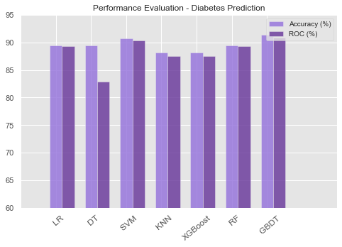

# Obesity-Classification

[Link to Report](https://github.com/pymche/Machine-Learning-Obesity-Classification/blob/master/Obesity_Classification.ipynb)

Prediction of levels of obesity by using machine learning classification models.

Data collected from [UCI Machine Learning Repository](https://archive.ics.uci.edu/ml/datasets/Estimation+of+obesity+levels+based+on+eating+habits+and+physical+condition+). Official publication of the research that provides data can be accessed from [here](https://www.sciencedirect.com/science/article/pii/S2352340919306985?via%3Dihub).

## About the Data

Dietary, exercise and personal daily habits of individuals from Mexico, Peru and Columbia are recorded to build estimation of obesity levels.

Obesity Level will be used as the target (y) variable, which consists of 7 classes - Insufficient Weight, Normal Weight, Overweight Level I, Overweight Level II, Obesity Type I, Obesity Type II and Obesity Type III.

There are 17 attributes in total related to individual habits that are likely to determine obesity levels, such as number of main meals, time using technology devices, gender and transportation used. 

Details of the questions and possible answers collected for the data can be found in the link provided above.

## Preparing the data for exploratory analysis

The values of some of the attributes from the original data set are numerical and does not describe the actual answers provided by individuals. In order to visualise the data, I have assigned the corresponding answer to each numerical value and temporary transformed the entire data set into a categorical data for plotting.

## Preprocessing the data

In the original data set, there are numerical (both continuous and discrete) and categorical (including ordinal, non-ordinal and binary - i.e. yes & no) data.
Imputation is used in both numerical and categorical data to fill in missing values. Feature scaling is employed for continuous numerical values, including age, weight and height; Ordinal and Label Encoding are used for non-ordinal categorical data, such as transportation used and obesity level, while One Hot Encoding is applied to data which is ordinal in nature (e.g. never, sometimes, always). 

All of the above preprocessing procedures are bundled into a pipeline, which also applies multiple models on the data set in search for the best model.

## Models used for classification

* K Nearest Neighbour
* Decision Tree
* Random Forest
* Adaboost
* Stochastic Gradient Descent
* Support Vector Machine

 

First commit: 1st September, 2020
